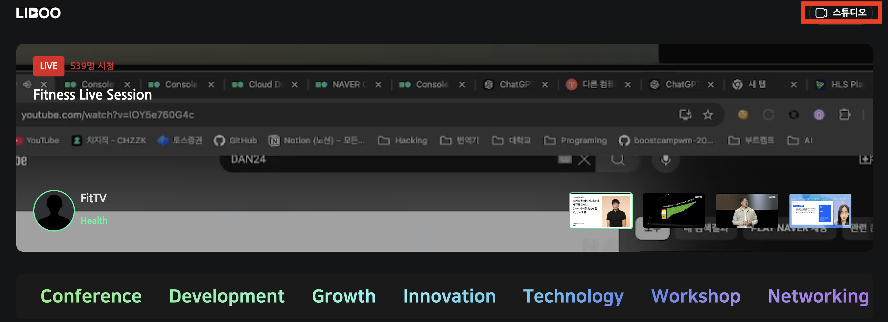
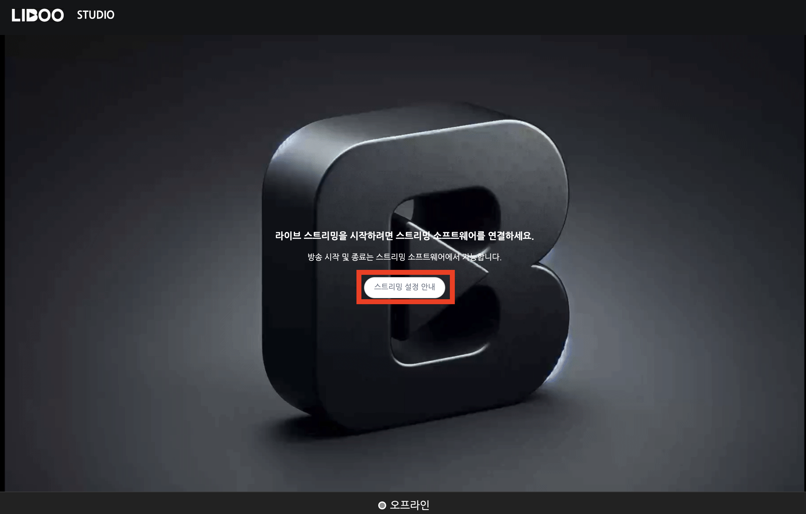
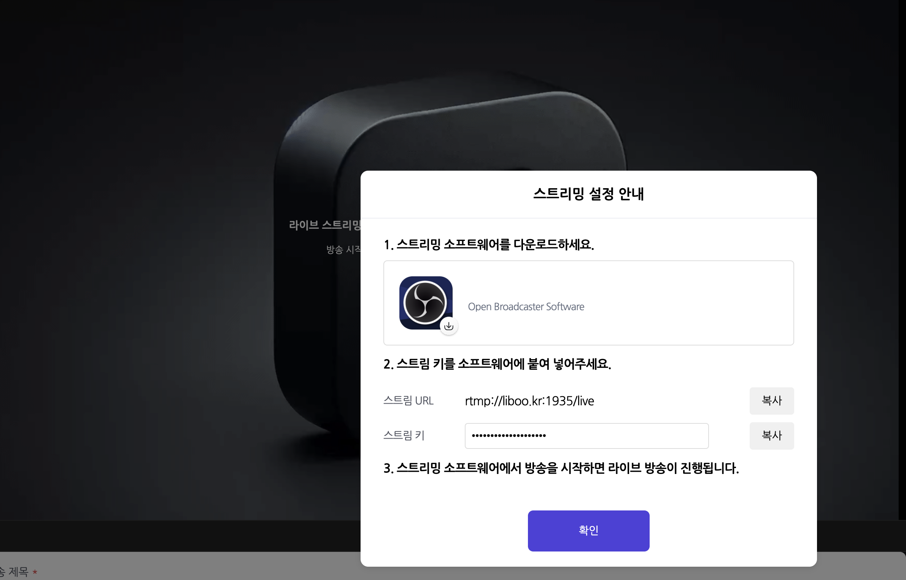
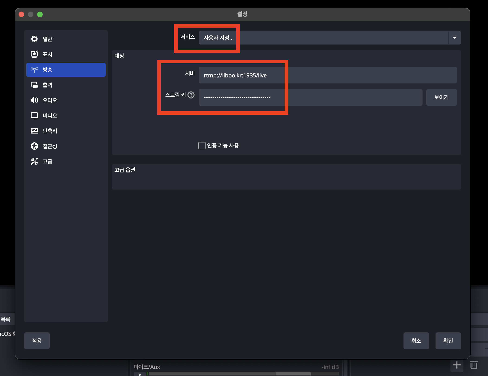
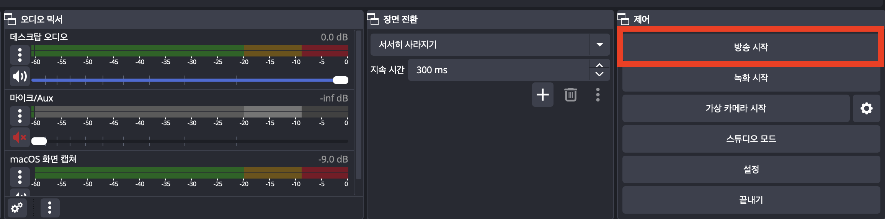
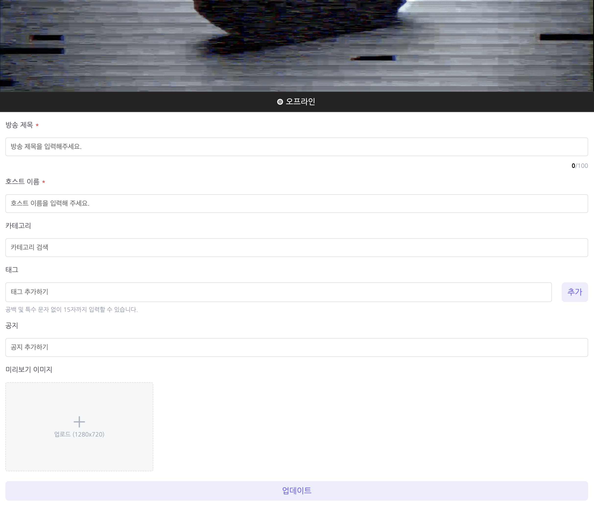
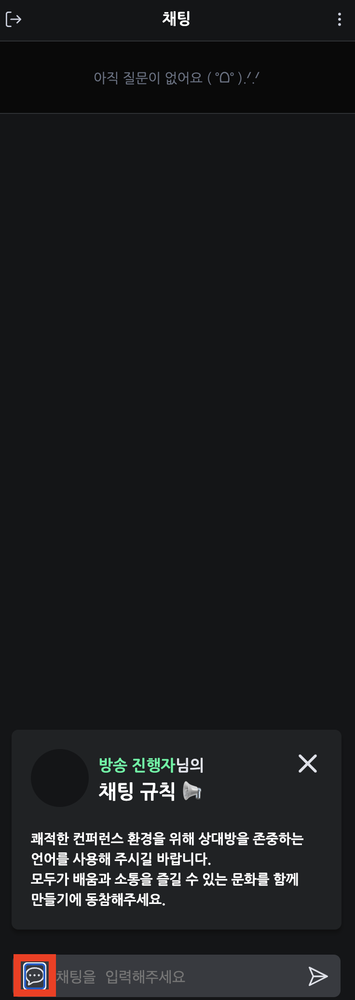
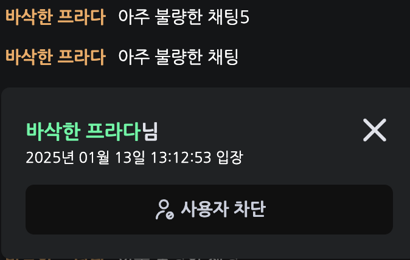
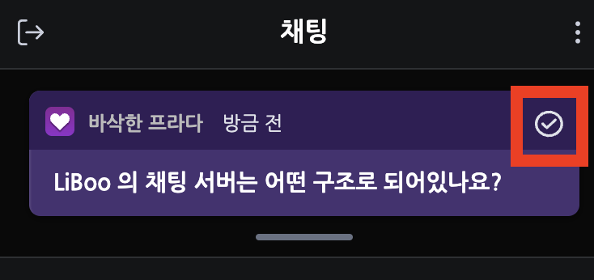

# 목차

1. [시작하기](#시작하기)
    - [방송 호스트](#방송-호스트)
        - [OBS를 통해 방송 송출하기](#OBS를-통해-방송-송출하기)
        - [일반 채팅 / 공지 채팅 전환](#일반-채팅--공지-채팅)
        - [악성 시청자 차단](#악성-시청자-차단)
        - [질문 답변 처리](#질문-답변-처리)
    - [시청자](#시청자)
        - [일반 채팅 / 질문 채팅 전환](#일반-채팅--질문-채팅)

# 시작하기

## 방송 호스트
### OBS 를 통해 방송 송출하기
1. 오른쪽 상단의 `스튜디오` 버튼을 통해 방송 스튜디오에 진입해주세요.

2. 화면 중앙에 `스트리밍 설정 안내` 버튼을 클릭해서 Stream Key 를 발급받아 주세요.

3. OBS 에서 [Settings] → [방송] 탭으로 들어가 `서비스` 를 `사용자 지정`으로 바꾸고 `서버` 와 `스트림 키` 에 각각 화면의 `스트림 URL` 과 `스트림 키`를 넣어주세요.

4. 방송 시작 버튼을 통해 방송을 시작해주세요

5. 일정 시간(10초 ~ 30초)이 지난 후에 `오프라인` 이 `온라인` 으로 자동 변경 되는지 확인하고, 아래의 방송 정보를 입력하고 업데이트를 눌러주세요.
이때부터 시청자들이 해당 방송을 시청할 수 있도록 메인 대시보드에 방송이 노출됩니다.

### 일반 채팅 / 공지 채팅
- 아래의 버튼을 통해 일반 채팅과 공지 채팅을 전환할 수 있습니다.

### 악성 시청자 차단
- 시청자의 이름을 클릭해서 사용자를 차단할 수 있습니다.

### 질문 답변 처리
- 시청자의 질문을 체크 버튼을 통해서 완료시킬 수 있습니다. 완료된 질문은 리스트에서 사라집니다.

## 시청자
## 일반 채팅 / 질문 채팅
- 아래의 버튼을 통해 일반 채팅과 질문 채팅을 전환할 수 있습니다.

